##  傅立叶变化相关

1. 原始写法：   
k = fft(x)  
x = ifft(k)

2. 为了让 k 更好地显示，使用fftshift 和  ifftshift   
k_shift = fftshift(k)  # 用于显示  
k = ifftshift(k_shift) #  用于计算

所以， fftshift 和 ifftshift只是针对k空间信号

## Parseval's theorem (Rayleigh's theorem or Power theorem)

$$\int_{-\infty}^{\infty}|f(x)|^{2}dx=\int_{-\infty}^{\infty}|F(s)|^{2}ds$$

For discrete time signals, the theorem becomes:
$$\sum_{n=0}^{N-1}|x[n]|^{2}=\frac{1}{N}\sum_{k=0}^{N-1}|X[k]|^{2}$$

<center>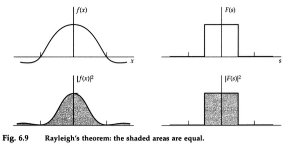</center>

code:
``` python
import numpy as np
import matplotlib.pyplot as plt

# Create a signal composed of two sine waves
fs = 1000  # sampling frequency
t = np.arange(0, 1, 1/fs)  # time array
f1, f2 = 5, 40  # frequencies of the sine waves
a1, a2 = 0.7, 0.3  # amplitudes of the sine waves
x = a1 * np.sin(2 * np.pi * f1 * t) + a2 * np.sin(2 * np.pi * f2 * t)  # the signal

# Compute FFT
X = np.fft.fft(x)

# Compute energy in time domain
Et = np.sum(x**2)

# Compute energy in frequency domain
Ef = np.sum(np.abs(X)**2) / len(X)

# Print the energies
print(f'Energy in time domain: {Et}')
print(f'Energy in frequency domain: {Ef}')

# Check if they are close (due to numerical precision, they might not be exactly equal)
if np.allclose(Et, Ef):
    print('Parseval\'s theorem is verified.')
else:
    print('Parseval\'s theorem is not verified.')

# Visualize signal and its spectrum
plt.figure(figsize=(12, 4))

plt.subplot(1, 2, 1)
plt.plot(t, x)
plt.title('Signal in Time Domain')

plt.subplot(1, 2, 2)
freqs = np.fft.fftfreq(len(x), 1/fs)
plt.plot(freqs[:len(freqs)//2], np.abs(X[:len(X)//2]))
plt.title('Spectrum of the signal')

plt.show()
```

## Oddness and Evenness
$$
\begin{array}{c}
E(-x)=E(x)\\
O(-x)=-O(x)\\
f(x)=E(x)+O(x)\\
f(-x)=E(x)-O(x)\\
E(x)=\cfrac{1}{2}[f(x)+f(-x)]\\
O(x)=\cfrac{1}{2}[f(x)-f(-x)]
\end{array}$$

$$\begin{alignedat}{1}F(s) & =\int_{-\infty}^{\infty}f(x)[\cos(2\pi sx)+i\sin(2\pi sx)]dx\\
 & =\int_{0}^{\infty}f(x)[\cos(2\pi sx)+i\sin(2\pi sx)]dx+\int_{-\infty}^{0}f(x)[\cos(2\pi sx)+i\sin(2\pi sx)]dx\\
 & =\int_{0}^{\infty}f(x)[\cos(2\pi sx)+i\sin(2\pi sx)]dx+f(-x)[\cos(2\pi sx)-i\sin(2\pi sx)]dx\\
 & =\int_{0}^{\infty}(E(x)+O(x))[\cos(2\pi sx)+i\sin(2\pi sx)]dx+(E(x)-O(x))[\cos(2\pi sx)-i\sin(2\pi sx)]dx\\
 & =\int_{0}^{\infty}2E(x)\cos(2\pi sx)dx+2i\cdot O(x)\sin(2\pi sx)dx
\end{alignedat}
$$

<center>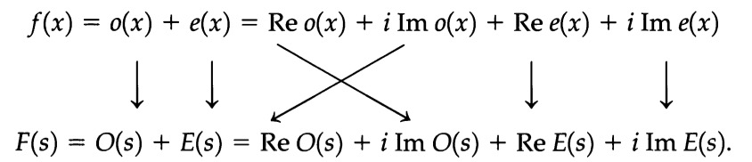</center>

$$\begin{alignedat}{1}F(s) & =\underset{F_{c}(s)}{\underbrace{2\int_{0}^{\infty}E(x)\cos(2\pi sx)dx}}+i\cdot\underset{F_{s}(s)}{\underbrace{2\int_{0}^{\infty}O(x)\sin(2\pi sx)dx}}\\
 & =F_{c}(s)+iF_{s}(s)\\
 & ={\cal F}[E(x)]+i{\cal F}[O(x)]\\
 & =\cfrac{1}{2}{\cal F}[f(x)+f(-x)]+\cfrac{i}{2}\cdot{\cal F}[f(x)-f(-x)]
\end{alignedat}
$$

```python
import numpy as np
import matplotlib.pyplot as plt

# Define the function f(x) = x + x^2
def f(x):
    return x + x**2

def f_odd(x):
    return 0.5 * (f(x)-f(-x))

def f_even(x):
    return 0.5 * (f(x)+f(-x))

# Define the range of x values over which to calculate the Fourier Transform
x_values = np.linspace(-10, 10, 10)

# Calculate the Fourier Transform using the above formula
def fourier_transform(f, x_values, omega):
    integrand = f(x_values) * np.exp(-1j * omega * x_values)
    return np.trapz(integrand, x=x_values)

# Define the range of angular frequencies (ω) over which to calculate the Fourier Transform
omega_values = np.linspace(-10, 10, 10)

# Calculate the Fourier Transform for each value of ω
result = [fourier_transform(f, x_values, omega) for omega in omega_values]

result_odd = [fourier_transform(f_odd, x_values, omega) for omega in omega_values]
result_even = [fourier_transform(f_even, x_values, omega) for omega in omega_values]

result2 = [e.real + 1j * o.imag for e, o in zip(result_even, result_odd) ]

print(result)
print(result2)
```

## Convolution
$$h(x)=f(x)*g(x)=\int_{-\infty}^{\infty}f(u)g(x-u)\ du$$

<center>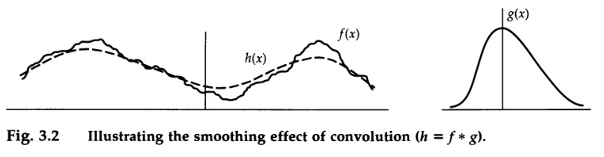</center>

Convolution finds extensive use in various fields. In signal processing, it is used for **filtering** and **smoothing** signals. In image processing, convolution is employed for tasks such as **edge detection** and **blurring**. In deep learning, convolutional neural networks **(CNNs)** use convolution to detect features in images and learn spatial patterns.

## Useful Functions

<center>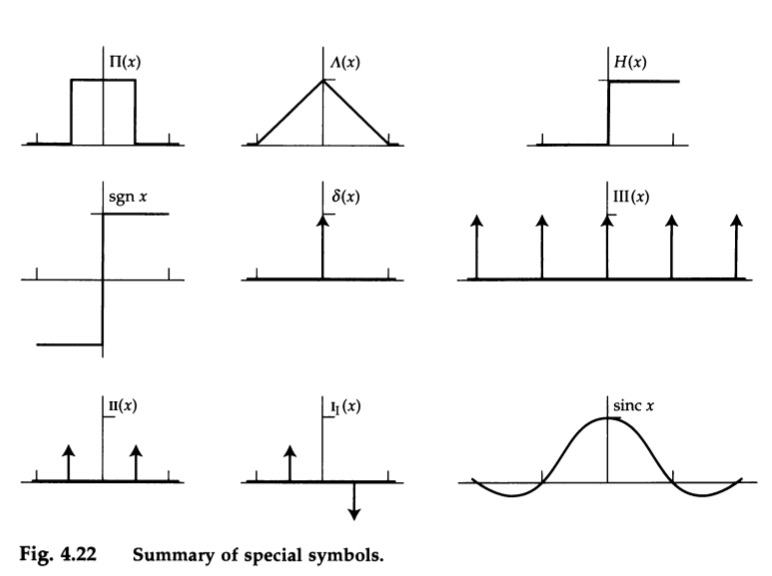</center>

<center>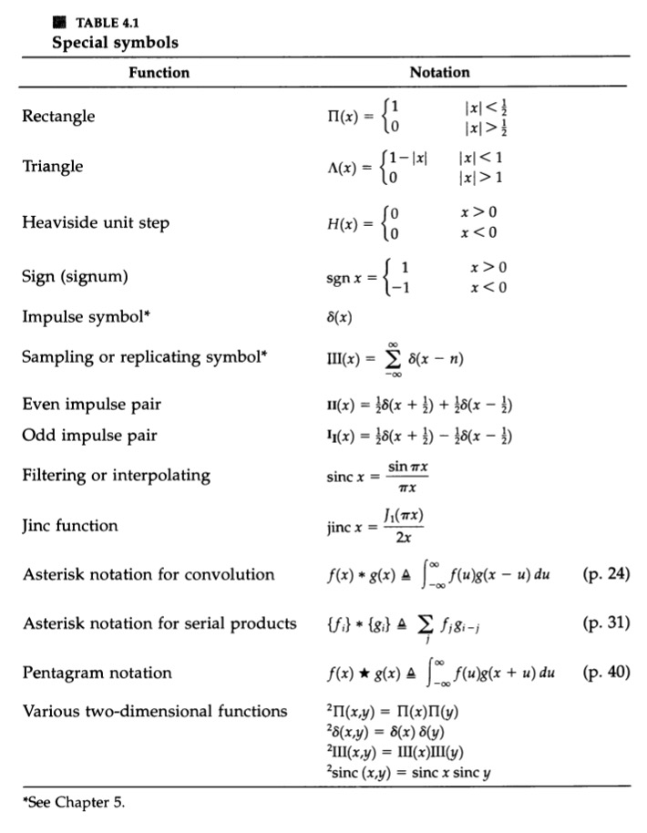</center>

### 1. Rectangle function

$$\Pi(x)=\begin{cases}
0 & |x|>\frac{1}{2}\\
(\frac{1}{2} & |x|=\frac{1}{2})\\
1 & |x|<\frac{1}{2}
\end{cases}$$


$$f(x)=\Pi(x)\cos\pi x=\begin{cases}
0 & x<-\frac{1}{2}\\
\cos\pi x & -\frac{1}{2}<x<\frac{1}{2}\\
1 & \frac{1}{2}<x
\end{cases}$$

<center>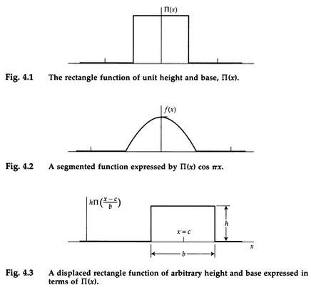</center>

能结合convolution来计算running means. running mean就是在一定窗口期做的mean，有Simple Moving Average (SMA)，Weighted Moving Average (WMA)和Exponential Moving Average (EMA)。Rectagle function应该是SMA。

### 3.Triangle Function

$$\Lambda(x)=\begin{cases}
0 & |x|>1\\
1-|x| & |x|<1
\end{cases}$$

self-convolution of $\Pi(x)$

<center>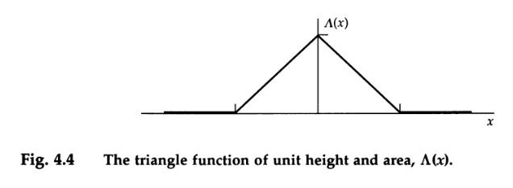</center>

### 4.Exponential functions
<center>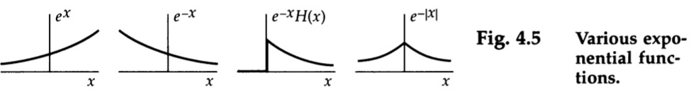</center>

<center>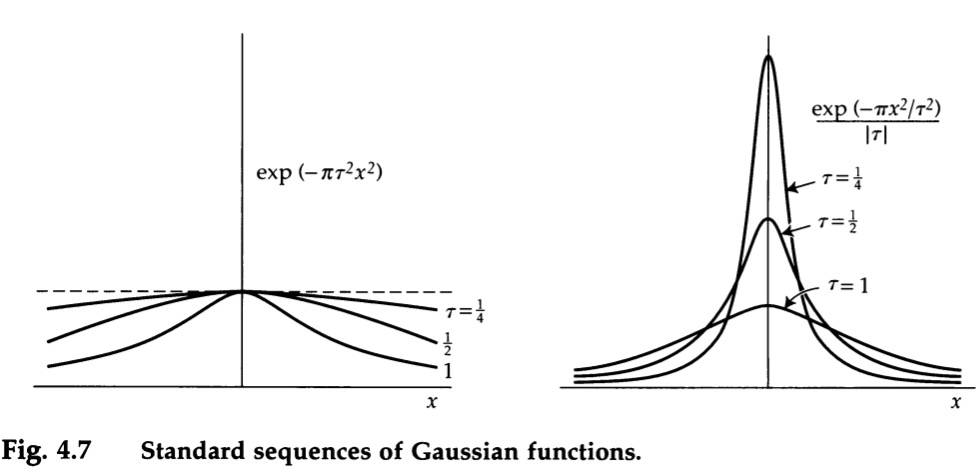</center>

### 5.Step function H(x)

$$H(x)=\begin{cases}
0 & x<0\\
(\frac{1}{2} & x=0)\\
1 & x>0
\end{cases}$$

<center>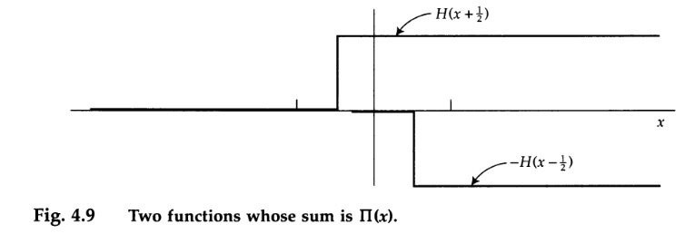</center>

$$\Pi(x)=H(x+\frac{1}{2})-H(x-\frac{1}{2})$$


Ramp function    

$$\begin{alignedat}{1}R(x) & =xH(x)\\
 & =\int_{-\infty}^{x}H(x')dx'\\
 & =\int_{-\infty}^{\infty}H(x')H(x-x')dx'\\
 & =H(x)*H(x)
\end{alignedat}
$$
$$R'(x)=H(x)$$

<center>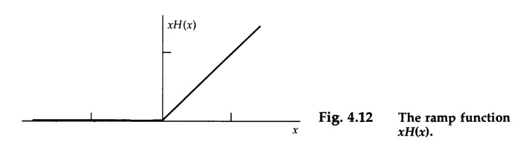</center>

$$H(x)*f(x)=\int_{-\infty}^{\infty}f(x')H(x-x')dx'=\int_{-\infty}^{x}f(x')dx's$$

$$f(x)=\cfrac{d}{dx}\left[H(x)*f(x)\right]$$

### 6.Sign function, sign x
$${\rm sgn}\ x=\begin{cases}
-1 & x<0\\
1 & x>0
\end{cases}$$

$${\rm sgn}\ x=2H(x)-1$$
<center>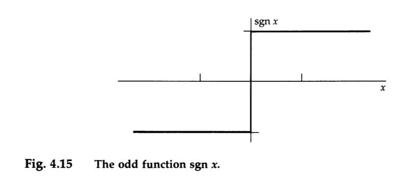</center>

### 7.Filtering or Interpolating function, sinc x

$${\rm sinc}\ x=\cfrac{\sin\pi x}{\pi x}$$
1D Fourier transform pair: $\Pi(s)$    

properties:

$$\begin{cases}
{\rm sinc}\ 0=1\\
{\rm sinc}\ n=1 & n=\text{nonzero integer}\\
\int_{-\infty}^{\infty}{\rm sinc}\ x\ dx=1
\end{cases}$$

$${\rm sinc}\ x=\cfrac{d}{dx}\cfrac{{\rm Si}(\pi x)}{\pi}$$

$${\rm Si}\ x=\int_{0}^{x}\cfrac{\sin u}{u}du$$

$$\cfrac{{\rm Si}(\pi x)}{\pi}=\int_{0}^{x}{\rm sinc}\ u\ du$$

$$H(x)*{\rm sinc}\ x=\int_{-\infty}^{x}{\rm sinc}\ u\ du=\cfrac{1}{2}+\cfrac{{\rm Si}(\pi x)}{\pi}$$

<center>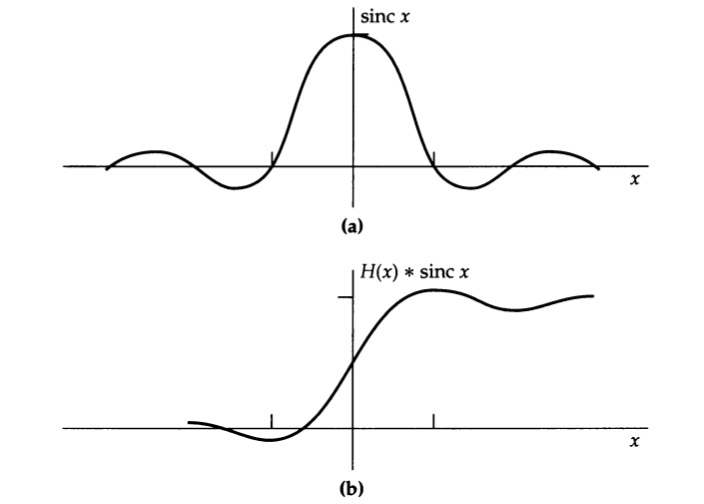</center>

$${\rm sinc}^{2}x=\left(\cfrac{\sin\pi x}{\pi x}\right)^{2}$$

2D Fourier transform pair: $\Pi(s)$    

properties:

$$\begin{cases}
{\rm sinc}^{2}\ 0=1\\
{\rm sinc}^{2}\ n=0 & n=\text{nonzero integer}\\
\int_{-\infty}^{\infty}{\rm sinc}^{2}\ x\ dx=1
\end{cases}$$

<center>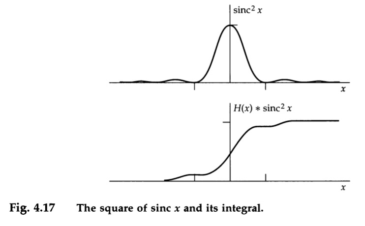</center>