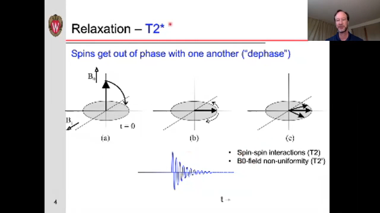
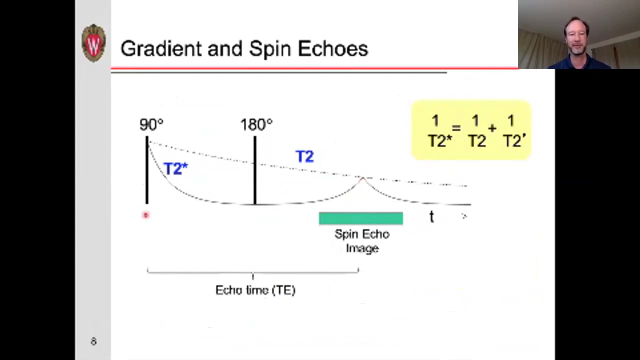
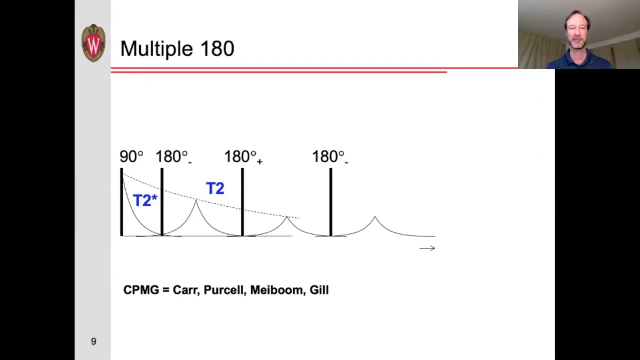
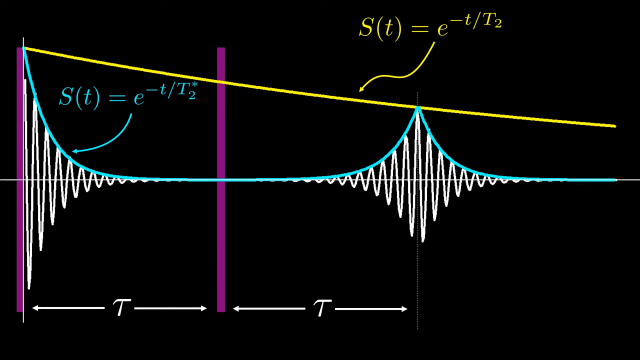

## Spin Echo

refer: https://www.youtube.com/watch?v=XgIytITAWe0

relaxation会导致相位变化，并导致信号消失。relaxation是由于磁场发生变化，有两种方式会导致relaxation：

1. Spin-spin interactions ($T_2$) -- not reversible
2. B0-field non-uniformity ($T_2^*$) -- can use 180 

这两个动画都不错：

https://www.youtube.com/watch?v=FxyiH2TjQvI

https://youtu.be/M7yh0To6Wbs?t=1808

通过设置不同的 $T_2^*$ 可以用来计算 $T_2$

